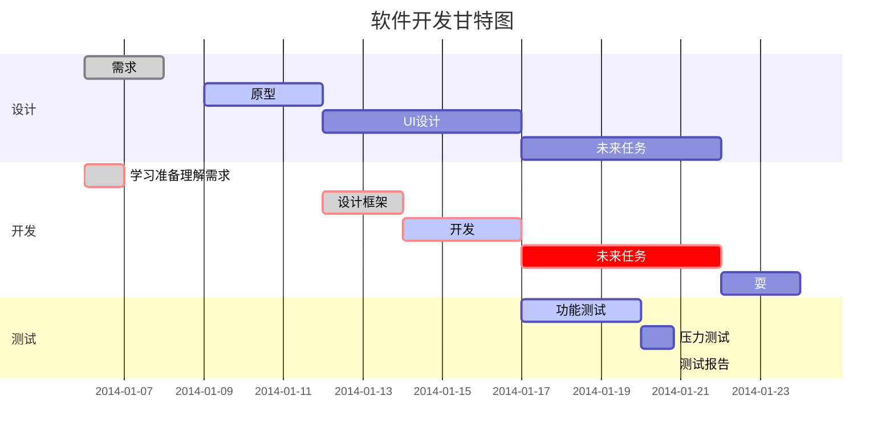

# Sprint 任务规划



```mermaid
gantt
dateFormat  YYYY-MM-DD
title 软件开发甘特图
    section 设计
    需求                      :done,    des1, 2014-01-06,2014-01-08
    原型                      :active,  des2, 2014-01-09, 3d
    UI设计                     :         des3, after des2, 5d
    未来任务                     :         des4, after des3, 5d
section 开发
    学习准备理解需求                      :crit, done, 2014-01-06,24h
    设计框架                             :crit, done, after des2, 2d
    开发                                 :crit, active, 3d
    未来任务                              :crit, 5d
    耍                                   :2d
section 测试
    功能测试                              :active, a1, after des3, 3d
    压力测试                               :after a1  , 20h
    测试报告                               : 48
```
## 5 -11

结束,清理当前分支的任务。

创建新分支并开始。

```mermaid

```
## 12-18

## 19-25

## 26-02

