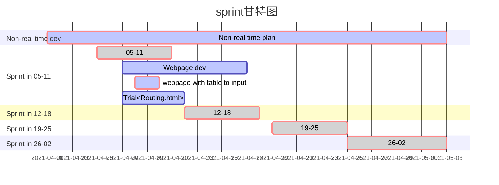

## 5 -11

> 结束,清理当前分支的任务。结束web页面的一些尝试性功能包括，statistic页面下的flowtable，以及topology页面上的host弹窗；
>
> - 需求，以testcase列举：
>
>   - flowtable 在有流表时，能在flowtable中记录并显示所有的流表；
>   - topology中，host在第二次触发popup 弹窗时，能够显示其attachment端口信息；
>   - 删除不必要的switch popup 中的信息，变简洁。

创建新分支并开始接下来的任务。

- sprint log
  - 建立表格接收非实时的json数据格式
  - 写module 返回所有的QoS 数据到前端。
  - 另一个<u>尝试</u>：在routing.html 中手动输入一个metic是否有效，尝试修复并运行以熟悉web展示的逻辑。

## 12-18

> 上午上课，下午去公司实习

## 19-25

## 26-02

